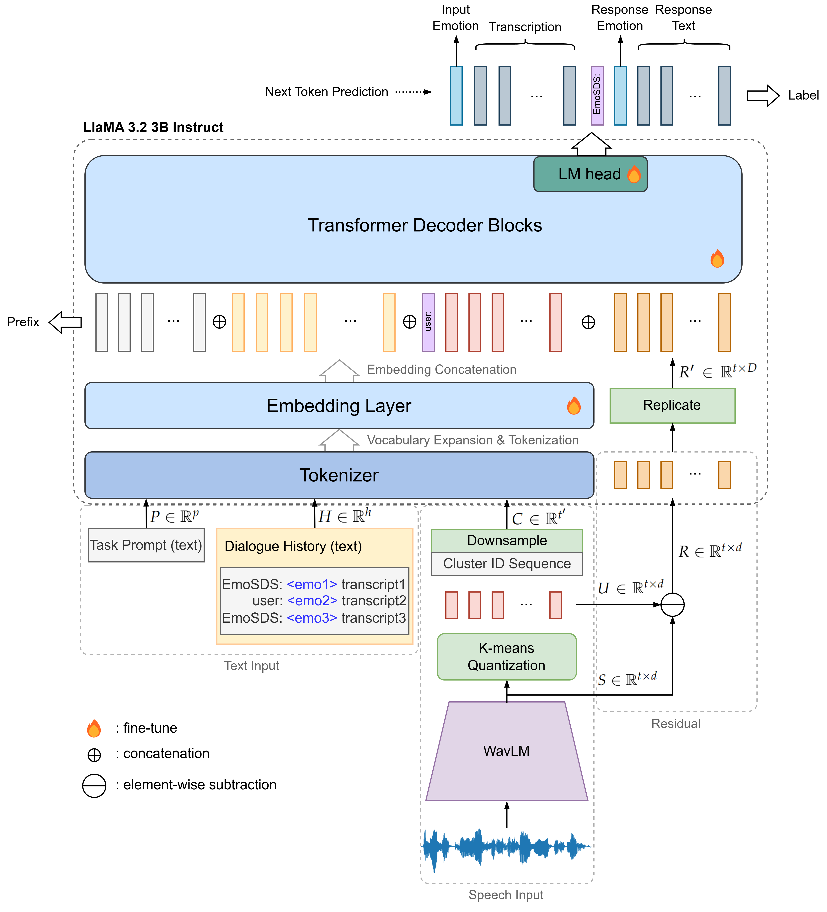

# EmoSDS
This is repository of EmoSDS: Emotionally Adaptive Spoken dialogue System paper



## Abstract
...

## How to train
Prerequisites:

1. python 3.8 env (refer to requirements.txt for all dependencies)

2. LlaMA 3.2 3B

	you can download it from: https://huggingface.co/meta-llama/Llama-3.2-3B-Instruct

3. pretrained Kmeans model

	you can download it from our google drive


All commands below should be executed at EmoSDS/ working directory
### Stage 1
You should download LibriSpeech train-clean-100 dataset

```python
# create stage 1 data
python3 utils/build_data.py asr --librispeech-dir /path/to/your/librispeech/data

# train
bash scripts/asr_sft.sh
```

### Stage 2

Download ESD from [ESD official repository](https://github.com/HLTSingapore/Emotional-Speech-Data).

Download residual files from our google drive

You can download stage 1 model checkpoint from our google drive too.

```python
# create stage 2 data
python3 utils/build_data.py asr+ser --esd-dir /path/to/your/ESD/data --residual

# train
bash scripts/asr_ser_sft.sh # in the script, you should specify checkpoint path in METAROOT variable
```

### Stage 3

Download synthesized dialogue data from our google drive

You can download stage 2 model checkpoint from our google drive too.

```python
# create stage 3 data (EmoSC)
python3 utils/build_data.py unified --esd-dir /path/to/your/ESD/data --esd-syn-path /path/to/dialogue/data

# train
bash scripts/unified_sft.sh # in the script, you should specify checkpoint path in METAROOT variable
```

## Acknowledgement
Portions of the research in this paper used the ESD Database made available by the HLT lab, National University of Singapore, Singapore.

The codes are derived and modified from SpeechGPT
